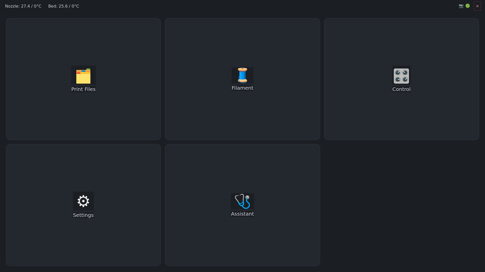
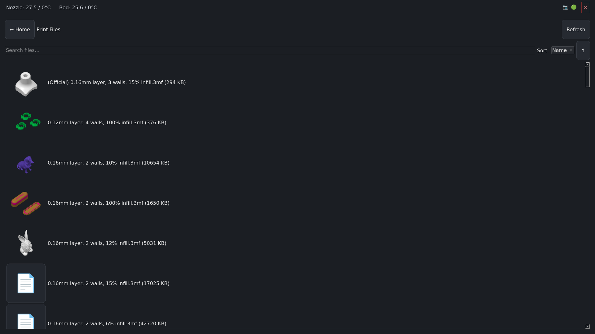

# P1S Touch Screen

A PySide6 (Qt6) GUI for a Raspberry Pi with an attached touchscreen that
controls a Bambu Lab P1S over the local network, emulating the onboard
control screens the P1S doesn't have (unlike the A1/A1 mini/X1). Talks to
the printer via [`bambulabs_api`](https://pypi.org/project/bambulabs-api/)
over Bambu's LAN-mode MQTT/FTP protocol.

Screens: Home, Print Files (browse/search/sort, 3MF/STL thumbnails),
Print Monitor (live camera, progress, pause/resume/stop), Filament/AMS
(4-slot), Control (jog/home/extrude/fans/light/temps), Settings.

## Screenshots

| Home | Print Files |
| --- | --- |
|  |  |

## Disclaimer / limitation of liability

This is an independent, unofficial hobby project, not affiliated with or
endorsed by Bambu Lab. It sends real commands to a real 3D printer,
including heater setpoints, motion, and print start/stop -- software bugs,
network issues, or misuse can cause failed prints, wasted material,
damage to the printer, or in the worst case a fire or other property
damage or injury if the printer is left unattended or its own safety
features are disabled or malfunction.

**This software is provided "as is", without warranty of any kind,
express or implied.** By downloading, installing, or using this software
you agree that you do so entirely at your own risk, and that the author(s)
and contributors shall not be liable for any claim, damages, or other
liability -- whether in an action of contract, tort, or otherwise --
arising from, out of, or in connection with the software or the use or
other dealings in the software, including but not limited to damage to
your printer, your property, or any other property, or personal injury.
You are solely responsible for supervising your printer and for complying
with your printer manufacturer's safety guidance while using this or any
third-party control software.

Always follow standard 3D printer safety practice: use a smoke/fire
detector near the printer, don't leave it printing unattended for long
periods, and use a printer that itself has functioning thermal-runaway
protection.

## Printer setup (required)

This app only works over Bambu's **local network (LAN) protocol** -- it
does not use Bambu's cloud. On the printer itself (screen or Bambu
Studio/Handy), under network settings, enable:

- **LAN Only Mode** -- required for any local connection at all. Enabling
  it shows the printer's **IP address**, **access code**, and **serial
  number**, which go in `config.yaml` (see below). Note this also
  disconnects the printer from Bambu's cloud service -- you won't be able
  to use the cloud-based Bambu Handy app or cloud slicing while it's on.
- **Developer Mode** -- required in addition to LAN Only Mode for the
  Control screen's homing, jog, extrude, and fan commands (these go over
  raw G-code MQTT commands that the printer only accepts in Developer
  Mode). Print Files, Print Monitor, and Filament/AMS work with LAN Only
  Mode alone, but turn Developer Mode on too unless you specifically want
  the Control screen disabled.

Both toggles are printer settings, not app settings -- re-enable them
after any printer firmware update if they get reset.

## Setup

Requires Python 3.10+.

```bash
git clone <this repo>
cd p1sTouchScreen
python3 -m venv .venv
source .venv/bin/activate
pip install -r requirements.txt

cp config.example.yaml config.yaml
# edit config.yaml: printer.ip / access_code / serial from the printer's
# LAN Only Mode screen (see "Printer setup" above)
```

## Running

```bash
python3 main.py             # uses config.yaml's app.backend setting
python3 main.py --mock      # force the mock backend -- no printer needed,
                             # useful for UI development
python3 main.py --windowed  # don't go fullscreen (handy on a dev machine)
```

Fullscreen vs. windowed can also be toggled at runtime from the Settings
screen; the choice is saved back to `config.yaml`.

## Kiosk deployment (Raspberry Pi)

See `deploy/`:

- `p1s-touchscreen.service` -- a `systemd --user` unit with
  `Restart=on-failure`, for autostart + crash recovery on Raspberry Pi OS
  Bookworm/labwc (Wayland, the default compositor on Pi 4/5).
- `autostart-labwc.desktop` -- labwc autostart entry.
- `x11-fallback.md` -- notes for older X11-based Pi OS images.

## License

[MIT](LICENSE)
